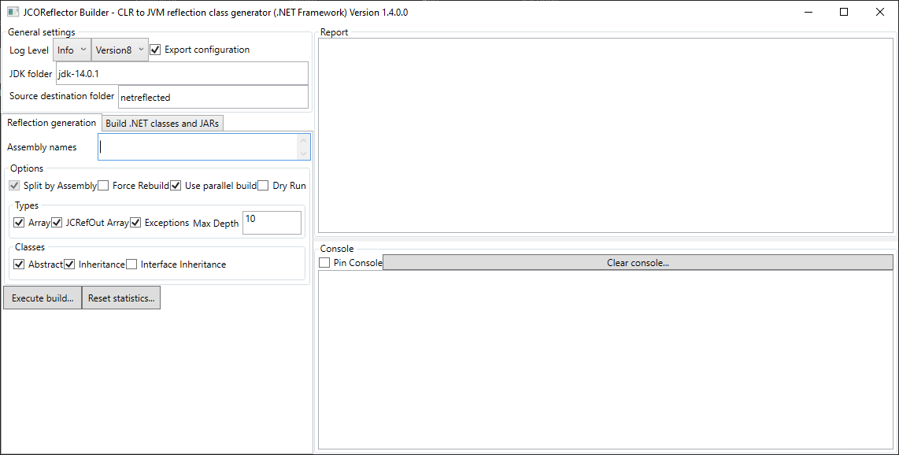
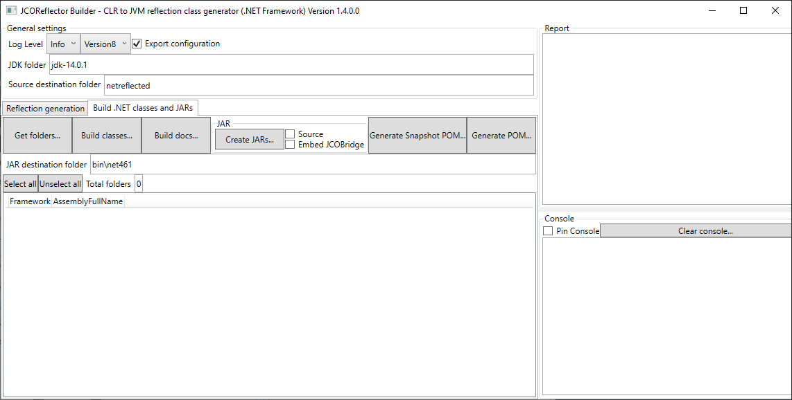

# Using JCOReflector

This article covers the three things needed to work with JCOReflector: using the artifacts already published on Maven Central, what happens when the runtime starts, and how to generate the artifacts yourself with the reflection tool.

## Using the artifacts published on Maven Central

JCOReflector publishes one artifact for each .NET flavor, all in the `com.masesgroup` group. They differ only in the artifact id:

| .NET flavor | Artifact id |
|:---|:---|
| .NET Framework (Windows only) | [`jcoreflector_net462`](https://central.sonatype.com/artifact/com.masesgroup/jcoreflector_net462) |
| .NET 8 | [`jcoreflector_net8.0`](https://central.sonatype.com/artifact/com.masesgroup/jcoreflector_net8.0) |
| .NET 9 | [`jcoreflector_net9.0`](https://central.sonatype.com/artifact/com.masesgroup/jcoreflector_net9.0) |
| .NET 10 | [`jcoreflector_net10.0`](https://central.sonatype.com/artifact/com.masesgroup/jcoreflector_net10.0) |

With Maven, add the dependency for the flavor you want to use:

```xml
<dependency>
    <groupId>com.masesgroup</groupId>
    <artifactId>jcoreflector_net462</artifactId>
    <version>1.16.2.0</version>
</dependency>
```

and with Gradle:

```groovy
implementation 'com.masesgroup:jcoreflector_net462:1.16.2.0'
```

To work with another framework, change only the artifact id, for example to `jcoreflector_net8.0`. The Java code does not change, as long as the classes it uses exist in the framework you selected.

> [!NOTE]
> The version shown above is the one published when this article was written. Check the Maven Central page of the artifact for the latest one.

A few things to know:

- The artifacts embed the JCOBridge runtime, so JCOBridge does not have to be added as a separate dependency.
- The minimum Java version is Java 8, and a .NET runtime matching the artifact must be available on the machine. See the project README for the full list of supported versions.
- JCOBridge has its own licensing, independent of the MIT license of JCOReflector: [JCOBridge 2.6.\*](https://www.jcobridge.com) can be used for free without any obligations. A commercial license must be purchased — or the software uninstalled — if you derive direct or indirect income from its usage.

## Initializing the runtime

All the examples of the project start with the same call:

```java
import org.mases.jcobridge.netreflection.JCOReflector;
import system.Console;

public class Hello {
    public static void main(String[] args) throws Throwable {
        JCOReflector.setCommandLineArgs(args);
        Console.WriteLine("Hello from .NET");
    }
}
```

No explicit initialization of the runtime is needed. JCOReflector starts everything the first time a reflected class is used: at that moment it initializes JCOBridge, which loads the CLR in the same process, and then serves every following request.

`setCommandLineArgs` only stores the command-line arguments of the application. They are handed to JCOBridge when the runtime initializes, so the call must come before the first use of a reflected class; once the runtime is initialized, the call is silently ignored. The call is optional: without it JCOBridge receives no arguments.

The same call is used in the other JVM languages:

```scala
JCOReflector.setCommandLineArgs(args)
```

```kotlin
JCOReflector.setCommandLineArgs(args)
```

```clojure
(JCOReflector/setCommandLineArgs (into-array String args))
```

### Other settings

`JCOReflector` offers a few more static settings. Some of them can be applied only before the runtime initializes, and are silently ignored afterwards:

| Setting | Purpose |
|:---|:---|
| `setCommandLineArgs(String[])` | Command-line arguments handed to JCOBridge |
| `registerPath(String)` | Registers a search path within the engine |
| `setInstanceByAssembly(boolean)` | Uses one JCOBridge instance per assembly instead of a single global one |
| `setUseFullAssemblyName(boolean)` | Uses the full assembly name, instead of the short one, when creating .NET types |

The following ones can be changed at any time:

| Setting | Purpose |
|:---|:---|
| `setDebug(boolean)` | Enables debug messages |
| `setLogging(boolean)` | Enables the logging of the JCOBridge events (to `JCOBridge.log` by default) |
| `setConsoleLog(boolean)` | Writes the JCOReflector log messages also to the console |

JCOReflector writes its own messages to a `JCOReflector.log` file, created in the working directory of the application.

## Reflecting assemblies with the JCOReflector tool

The published artifacts are produced by the reflection tool, and the same tool can reflect other assemblies or other framework versions.

### Getting the tool

In the root folder of the repository execute:

> dotnet build JCOReflector\JCOReflector.sln

or

> dotnet build JCOReflector\JCOReflectorCLI.sln

Within the folder bin you will find four subfolders:

- **net462** (available only on Windows platform)
- **net8.0** (available on .NET 8 supported platforms)
- **net9.0** (available on .NET 9 supported platforms)
- **net10.0** (available on .NET 10 supported platforms)

in each subfolder will be available two executables:

- **JCOReflectorCLI** the CLI tool;
- **JCOReflectorGUI** the GUI tool, below some screenshot:




The CLI is also available as a .NET tool:

> dotnet tool install --global MASES.JCOReflectorCLI

### Job files

The work of the tool is described by XML job files, one for each stage of the process. The `.github/workflows` folder of the repository contains the ones used by its own pipelines, one per stage and per framework:

| Stage | Root element | Job files | What it does |
|:---|:---|:---|:---|
| Reflect | `ReflectorEventArgs` | `reflect_net462.job`, `reflect_net8_0.job`, `reflect_net9_0.job`, `reflect_net10_0.job` | Generates the Java sources from the .NET assemblies |
| Build | `JavaBuilderEventArgs` | `build_linux.job`, `build_win19.job` | Compiles the generated sources with a JDK |
| Create JARs | `JARBuilderEventArgs` | `createjars_<framework>_<os>.job` | Packages the compiled classes into JARs, one for each assembly |
| Create POM | `POMBuilderEventArgs` | `createpom_win19.job` | Generates the Maven POM used to publish the artifacts |

The stages work on the same source folder (`src/jvm`), so the output of one is the input of the next. The `win19` files are the Windows variants, with backslash paths and the location of the JDK on the CI runner; the `linux` ones use forward slashes and a relative `jdk` folder. When running a job on your machine, adapt these paths to your environment.

#### Reflect

The reflect job lists the assemblies to start from and the generator options. This is the one for .NET 8 (the .NET 9 and .NET 10 ones differ only in the assembly version):

```xml
<?xml version="1.0" encoding="utf-8"?>
<ReflectorEventArgs xmlns:xsd="http://www.w3.org/2001/XMLSchema" xmlns:xsi="http://www.w3.org/2001/XMLSchema-instance">
  <LogLevel>Error</LogLevel>
  <AssemblyNames>
    <string>PresentationFramework, Version=8.0.0.0</string>
  </AssemblyNames>
  <SourceFolder>src/jvm</SourceFolder>
  <SplitFolderByAssembly>true</SplitFolderByAssembly>
  <ForceRebuild>true</ForceRebuild>
  <UseParallelBuild>true</UseParallelBuild>
  <CreateExceptionThrownClause>true</CreateExceptionThrownClause>
  <ExceptionThrownClauseDepth>10</ExceptionThrownClauseDepth>
  <EnableAbstract>true</EnableAbstract>
  <EnableArray>true</EnableArray>
  <EnableDuplicateMethodNativeArrayWithJCRefOut>true</EnableDuplicateMethodNativeArrayWithJCRefOut>
  <EnableInheritance>true</EnableInheritance>
  <EnableInterfaceInheritance>true</EnableInterfaceInheritance>
  <EnableRefOutParameters>true</EnableRefOutParameters>
  <EnableGenerics>true</EnableGenerics>
  <DryRun>false</DryRun>
</ReflectorEventArgs>
```

- **`AssemblyNames`** is the list of assemblies to reflect. The .NET Framework job uses full assembly names, including culture and public key token, for six assemblies. The published `net462` artifact contains many more assemblies than the ones named in the job, so the assemblies referenced by the listed ones are reflected too.
- **`SourceFolder`** is the folder where the Java sources are written, and **`SplitFolderByAssembly`** puts the sources of each assembly in its own folder.
- The **`Enable*`** options switch the corresponding features of the generator on (see "Implemented in the reflector" in the README). `EnableGenerics` activates the [experimental generics support](generics.md).
- **`CreateExceptionThrownClause`** and **`ExceptionThrownClauseDepth`** control the `throws` declarations added to the generated methods.

#### Build

The build job compiles the generated sources:

```xml
<?xml version="1.0" encoding="utf-8"?>
<JavaBuilderEventArgs xmlns:xsd="http://www.w3.org/2001/XMLSchema" xmlns:xsi="http://www.w3.org/2001/XMLSchema-instance">
  <LogLevel>Info</LogLevel>
  <SourceFolder>src/jvm</SourceFolder>
  <SplitFolderByAssembly>true</SplitFolderByAssembly>
  <JDKFolder>jdk</JDKFolder>
  <JDKTarget>Version8</JDKTarget>
  <JDKToolExtraOptions></JDKToolExtraOptions>
</JavaBuilderEventArgs>
```

`JDKFolder` is the JDK to use and must be changed to point to the JDK installed on your machine; it can also be supplied with the `-JDKFolder` switch of the CLI, as the project pipelines do. `JDKTarget` is the Java version targeted by the compilation: all the project jobs use `Version8`, matching the Java 8 baseline of the artifacts. `JDKToolExtraOptions` can carry extra options for the JDK tools.

#### Create JARs

The JAR job packages the compiled classes, and there is one for each framework and operating system (`createjars_net462_win19.job` is the only .NET Framework one, because that framework is available only on Windows):

```xml
<?xml version="1.0" encoding="utf-8"?>
<JARBuilderEventArgs xmlns:xsd="http://www.w3.org/2001/XMLSchema" xmlns:xsi="http://www.w3.org/2001/XMLSchema-instance">
  <CancellationToken />
  <LogLevel>Error</LogLevel>
  <SourceFolder>src/jvm</SourceFolder>
  <SplitFolderByAssembly>true</SplitFolderByAssembly>
  <JDKFolder>jdk</JDKFolder>
  <JDKTarget>Version8</JDKTarget>
  <JDKToolExtraOptions></JDKToolExtraOptions>
  <JarDestinationFolder>bin/net8.0</JarDestinationFolder>
  <WithJARSource>false</WithJARSource>
  <EmbeddingJCOBridge>true</EmbeddingJCOBridge>
</JARBuilderEventArgs>
```

The jobs of the different frameworks differ only in the platform paths and in `JarDestinationFolder`, which is `bin/net462`, `bin/net8.0`, `bin/net9.0` or `bin/net10.0`. `EmbeddingJCOBridge` embeds the JCOBridge runtime in the JARs, which is why the published artifacts do not need a separate JCOBridge dependency. `WithJARSource` controls whether the sources are included in the JARs.

#### Create POM

The POM job is the one used by the `maven.yaml` and `release.yaml` pipelines to publish the artifacts on Maven Central:

```xml
<?xml version="1.0" encoding="utf-8"?>
<POMBuilderEventArgs xmlns:xsd="http://www.w3.org/2001/XMLSchema" xmlns:xsi="http://www.w3.org/2001/XMLSchema-instance">
  <CancellationToken />
  <LogLevel>Error</LogLevel>
  <SourceFolder>src\jvm</SourceFolder>
  <SplitFolderByAssembly>true</SplitFolderByAssembly>
  <JDKTarget>Version8</JDKTarget>
</POMBuilderEventArgs>
```

The POM it generates is the one published with each artifact on Maven Central. It adds the source folder of every reflected assembly to the build, takes the JCOBridge runtime files from the `bin/<framework>` folder, attaches sources and Javadoc, signs the artifacts with GPG and publishes them with the Central Publishing plugin.

### Running the jobs

A job is run with the CLI tool: the `-JobType` switch selects the stage, `-JobFile` the job file, and `-JDKFolder` the JDK to use. This is how the project pipelines run the build, JAR and POM stages on Windows, here for .NET 8:

```
bin\net8.0\MASES.JCOReflectorCLI -JobType Build -JobFile .github\workflows\build_win19.job -JDKFolder <path to a JDK>
bin\net8.0\MASES.JCOReflectorCLI -JobType CreateJars -JobFile .github\workflows\createjars_net8_0_win19.job -JDKFolder <path to a JDK>
bin\net8.0\MASES.JCOReflectorCLI -JobType CreatePOM -JobFile .github\workflows\createpom_win19.job
```

On .NET 8 or later the tool can also be started through the `dotnet` host:

```
dotnet bin\net8.0\MASES.JCOReflectorCLI.dll -JobType Build -JobFile .github\workflows\build_win19.job -JDKFolder <path to a JDK>
```

On Linux the build and JAR stages have their own `linux` job files, while the POM stage has only the `win19` one.
